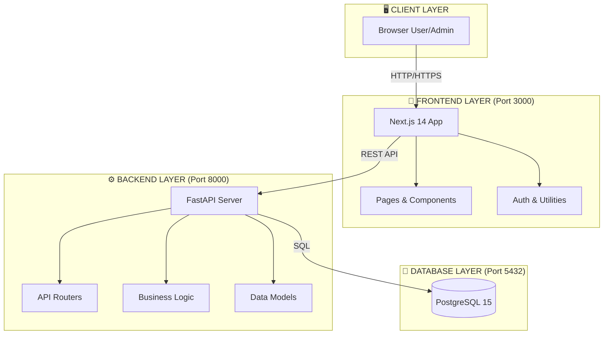
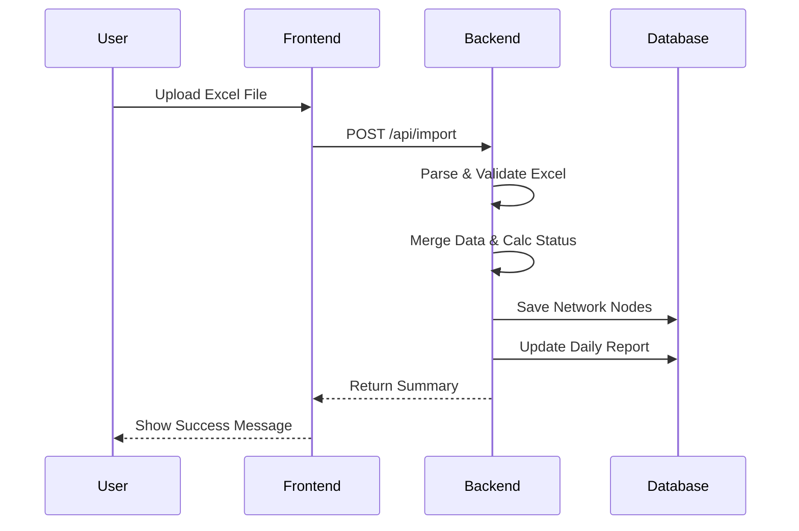
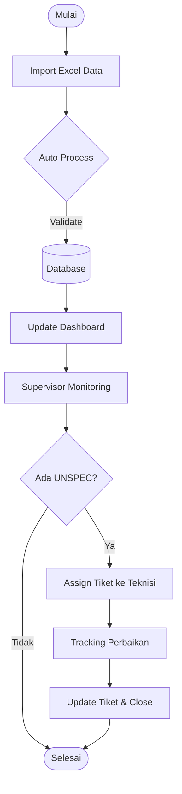

# Dashboard Monitoring Unspec WOC Balikpapan 🚀

> **Sistem Monitoring dan Manajemen Jaringan berbasis Web untuk PT Telkom Akses**

**Platform web modern** yang dirancang khusus untuk membantu tim **HD WOC Balikpapan** dalam memonitor, menganalisis, dan mengelola node jaringan yang mengalami *Unspec* (redaman tidak sesuai standar). Aplikasi ini menyediakan dashboard real-time, sistem pelaporan otomatis, dan tracking tiket service recovery.

---

## 📋 Daftar Isi

- [Tentang Aplikasi](#-tentang-aplikasi)
- [Fitur Utama](#-fitur-utama)
- [Teknologi yang Dipakai](#%EF%B8%8F-teknologi-yang-dipakai)
- [Arsitektur Sistem](#-arsitektur-sistem)
- [Cara Install](#-cara-install)
- [Cara Pakai](#-cara-pakai)
- [Alur Kerja Aplikasi](#-alur-kerja-aplikasi)
- [Database Schema](#-database-schema)
- [Maintenance](#-maintenance)

---

## 🎯 Tentang Aplikasi

### Latar Belakang

Dalam operasional jaringan **PT Telkom Akses**, salah satu parameter kritis yang harus dipantau adalah **redaman** (*signal loss*) pada setiap node pelanggan. Redaman yang tidak sesuai standar (UNSPEC) dapat menyebabkan degradasi kualitas layanan atau bahkan *service down*.

Sebelumnya, proses monitoring dan reporting dilakukan secara manual menggunakan Excel, yang memiliki beberapa kendala:
*   ❌ **Inefficient**: Update data memakan waktu lama.
*   ❌ **Error-prone**: Risiko *human error* dalam input dan kalkulasi.
*   ❌ **No Real-time**: Data tidak ter-update secara *real-time*.
*   ❌ **Limited Analysis**: Sulit melakukan analisis trend.
*   ❌ **Poor Collaboration**: Sulit koordinasi antar tim.

### Solusi

**Dashboard Monitoring Unspec** hadir sebagai solusi **digitalisasi** dan **automasi** proses monitoring jaringan dengan fitur:

*   ✅ **Auto-import** dari Excel semesta dan hasil ukur ulang.
*   ✅ **Dashboard real-time** dengan visualisasi data interaktif.
*   ✅ **Sistem reporting** otomatis dengan grafik trend.
*   ✅ **Tracking tiket** service recovery untuk maintenance.
*   ✅ **Filter & Search** advanced untuk analisis detail.
*   ✅ **Export report** ke Excel untuk dokumentasi.
*   ✅ **User management** dengan *role-based access*.

---

## ✨ Fitur Utama

### 1. Dashboard Overview 📊

Tampilan ringkasan kondisi jaringan secara keseluruhan untuk monitoring KPI utama.

*   **Total Customer per Tipe**: Breakdown pelanggan (Diamond, Gold, Platinum, Regular).
*   **Kualitas Jaringan**: Persentase node SPEC vs UNSPEC dengan indikator trend.
*   **Ticket Status**: Monitoring tiket maintenance (Open vs Closed).
*   **HVC Distribution Table**: Pivot table interaktif distribusi pelanggan HVC per STO.
*   **Status Kurma Table**: Breakdown SPEC vs UNSPEC per STO untuk identifikasi area problematik.
*   **Top ODP List**: List ODP dengan subscriber terbanyak untuk prioritas maintenance.

> **Use Case**: Supervisor cek dashboard pagi hari untuk identifikasi STO dengan UNSPEC tertinggi dan assign tim.

### 2. Data Explorer 🔍

Browser data network node secara detail dengan filter canggih.

*   **High-density Table**: Info lengkap (ND, ODP, RX Power, Status).
*   **Filtering Multi-dimensi**: Filter by STO, Sektor, Status (SPEC/UNSPEC).
*   **Search**: Cari by ND (Node ID) atau ODP.
*   **Color Coding**: 🟢 SPEC (Bagus), 🔴 UNSPEC (Perlu perbaikan).
*   **Export to Excel**: Download data terfilter dengan format rapi.

### 3. Service Recovery Tickets 🎫

Tracking dan management tiket perbaikan jaringan.

*   **Inline Editing**: Update status RFO, teknisi, dan redaman akhir langsung di tabel.
*   **Ticket Statistics**: Cards untuk memantau performa penyelesaian tiket.
*   **Filtering & Search**: Temukan tiket berdasarkan STO, Tanggal, atau Teknisi.

### 4. Report Bulanan 📈

Generate dan visualisasi laporan harian/bulanan.

*   **Saldo Unspec Chart**: Grafik performa penanganan gangguan harian (Saldo vs Target).
*   **Report Table**: Daily breakdown dengan indikator warna jika melebihi target.
*   **Export Report**: Download laporan lengkap ke Excel (termasuk grafik).

### 5. Update Data 📤

Upload dan import data dari Excel dengan validasi otomatis.

*   **Dual File Upload**: Support file "Unspec Semesta" dan "Ukur Massal".
*   **Auto-detection**: Otomatis mendeteksi tipe file dan validasi struktur.
*   **Smart Merge**: Menggabungkan data master dan hasil ukur ulang secara cerdas.
*   **Auto-categorization**: Menentukan status SPEC/UNSPEC berdasarkan threshold (-24.89 s/d -13.5 dB).

---

## 🛠️ Teknologi yang Dipakai

### Frontend (Client-side)
*   **Next.js 14**: React Framework dengan Server-Side Rendering (SSR).
*   **TypeScript**: Type-safe JavaScript untuk kode yang lebih robust.
*   **Tailwind CSS**: Utility-first CSS framework untuk styling cepat.
*   **shadcn/ui**: Library komponen UI yang modern dan accessible.
*   **Recharts**: Visualisasi data chart yang interaktif.

### Backend (Server-side)
*   **FastAPI**: Framework Python modern yang super cepat (High-performance).
*   **PostgreSQL 15**: Database relasional yang robust untuk production.
*   **SQLAlchemy**: ORM untuk manajemen database.
*   **Pandas**: Library processing data Excel yang powerful.

### Infrastructure
*   **Docker**: Containerization untuk environment yang konsisten.
*   **Docker Compose**: Orkestrasi multi-container (Frontend, Backend, DB).

---

## 🏗️ Arsitektur Sistem

Diagram arsitektur tingkat tinggi dari sistem WOC Dashboard.



### Data Flow

**1. Import Flow (Upload Excel)**


---

## 🚀 Cara Install

### Prerequisites
Pastikan sudah terinstall:
1.  **Docker Desktop** (v20.10+)
2.  **Git** (Optional)

### Installation Steps (Docker Recommended)

1.  **Clone Repository**
    ```bash
    git clone https://github.com/Just0rdinaryGuy/unspec-dash.git
    cd unspec-dash
    ```

2.  **Start Aplikasi**
    ```bash
    docker-compose up -d
    ```
    *Tunggu beberapa menit untuk proses build dan download image.*

3.  **Akses Aplikasi**
    *   **Frontend**: `http://localhost:3000`
    *   **Backend API**: `http://localhost:8000`
    *   **API Docs**: `http://localhost:8000/docs`

---

## 📖 Cara Pakai

### First Time Setup
1.  Buka `http://localhost:3000`.
2.  **Register** user baru (User pertama otomatis jadi **Admin**).
3.  Login dan masuk ke menu **Update Data**.
4.  Upload file Excel data awal ("Unspec Semesta" & "Ukur Massal").

### Daily Operations
*   **Monitor**: Cek Dashboard tiap pagi untuk lihat tren Unspec.
*   **Update**: Upload data Excel baru saat tersedia dari pusat.
*   **Action**: Filter node UNSPEC di "Data Explorer" -> Assign ke teknisi di "Service Recovery".
*   **Report**: Akhir bulan, masuk menu "Report" -> Export to Excel.

---

## 🔄 Alur Kerja Aplikasi

### Workflow: Daily Monitoring



---

## 💾 Database Schema

Struktur tabel utama dalam database PostgreSQL.

### `network_nodes`
Menyimpan data detail setiap node jaringan.

| Column | Type | Description |
| :--- | :--- | :--- |
| `nd` | VARCHAR | Node ID (Primary Key) |
| `sector` | VARCHAR | Area Sektor |
| `sto` | VARCHAR | Sentral Telepon Otomat |
| `odp` | VARCHAR | Optical Distribution Point |
| `rx_power` | FLOAT | Nilai Redaman (dBm) |
| `status` | VARCHAR | SPEC / UNSPEC |
| `unspec_type` | VARCHAR | Tipe Unspec (High/Low) |
| `updated_at` | TIMESTAMP | Waktu terakhir update |

### `service_tickets`
Menyimpan data tiket perbaikan (Service Recovery).

| Column | Type | Description |
| :--- | :--- | :--- |
| `id` | SERIAL | Ticket ID |
| `nd` | VARCHAR | Foreign Key ke Node |
| `ticket_no` | VARCHAR | Nomor Tiket (INC...) |
| `technician` | VARCHAR | Nama Teknisi |
| `status` | VARCHAR | OPEN / CLOSED |
| `rfo` | VARCHAR | Reason for Outage |
| `final_rx` | FLOAT | Redaman setelah perbaikan |

---

> **Note**: Dokumentasi ini dibuat otomatis untuk referensi tim pengembang dan pengguna sistem. Simpan manual book ini sebagai referensi utama operasional.
