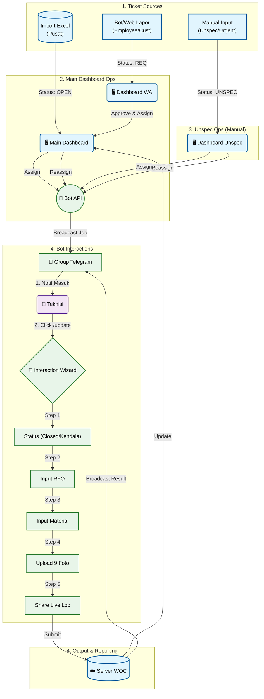

# 📘 WOC (Warga Online Ceria) - Master Documentation

> **Project Status:** need to verify by user  
> **Version:** 3.0 (Consolidated)

---

## 📋 Daftar Isi

1. [Ringkasan Eksekutif](#1-ringkasan-eksekutif-)
2. [Alur Kerja (Workflow)](#2-alur-kerja-workflow-)
3. [Spesifikasi Fungsional](#3-spesifikasi-fungsional-)
    - [3.1 Manajemen Tiket](#31-manajemen-tiket-)
    - [3.2 Distribusi & Notifikasi](#32-distribusi--notifikasi-)
    - [3.3 Interaksi Bot (Wizard)](#33-interaksi-bot-wizard-)
    - [3.4 Visualisasi Dashboard](#34-visualisasi-dashboard-web-)
    - [3.5 Realtime Tracking](#35-realtime-tracking-)
    - [3.6 Modul Reassign](#36-modul-reassign-operan-tiket--lanjutan-)
    - [3.7 Modul Analytics (Phase 3)](#37-modul-analytics--fraud-detection-phase-3-)
4. [Arsitektur Teknis (Database)](#4-arsitektur-teknis-database-)
5. [Rencana Eksekusi](#5-rencana-eksekusi-)

---

## 1. Ringkasan Eksekutif 📘

**WOC** adalah sistem manajemen pekerjaan lapangan yang mengintegrasikan **Dashboard Web** untuk monitoring dan **Telegram Bot** untuk eksekusi teknis (*"Headless Technician"*).

### 🎯 Tujuan Utama & Keunggulan Project

**1. Efisiensi & Speed (Anti-Frustasi)**
*   Memangkas birokrasi pelaporan manual **>80%** dengan konsep *Headless Technician*.
*   Fitur **Smart Skip Logic** membuat Bot "pintar" (Skip input material jika RFO non-fisik), sehingga teknisi tidak terbebani form yang tidak relevan.

**2. Validasi & Data Integrity (Anti-Fraud)**
*   Mencegah manipulasi data dengan **Strict Validation** (Wajib 9 Foto Evidence, Format ID Valid, & Geotagging Real-time).
*   Menutup celah "asal input" yang sering terjadi di sistem lama.

**3. Transparansi & Control (Real-Time Ops)**
*   Monitoring material, posisi teknisi, dan status tiket secara **Real-Time** (detik itu juga).
*   Memberikan kendali penuh kepada Helpdesk/Manager untuk melihat bottleneck tanpa perlu bertanya manual.

---

## 2. Alur Kerja (Workflow) 📊

Diagram di bawah ini menggambarkan aliran data dari sumber tiket hingga penyelesaian oleh teknisi.



---

## 3. Spesifikasi Fungsional ⚙️

### 3.1 Manajemen Tiket 🎫
*(Sumber: Import Excel & Input Manual)*

#### 1. Format Import Excel (.xlsx)

Tabel berikut menjelaskan mapping data dari Excel Pusat ke Database WOC.

| Header Kolom | Mapping DB | Tipe | Contoh Value |
| :--- | :--- | :--- | :--- |
| `Incident No` | `incident_no` | **Unique** | `INC12345` |
| `Service No` | `service_no` | Text | `122333` |
| `Customer Name` | `customer_name` | Text | `Bapak Budi` |
| `Sektor` | `sector` | Text | `BATU AMPAR` |
| `Checklist` | `checklist` | Text | `HVC_GOLD` |

#### 2. Input Manual / External Sources (Handling Unspec & WA)

**A. Internal Employee (Via Bot)**
*   **Akses**: Pegawai internal dapat melapor via Bot di Grup Telegram (Whitelist Group ID).
*   **Command**: `/lapor [Service ID] [Keluhan]`
*   **Logic (Smart Lookup)**:
    *   *Found*: Otomatis tarik Nama/Alamat dari DB (Fast Path).
    *   *Not Found*: Bot reply *"Data belum ada. Mohon input via Web Link."*

**B. Customer (Via Web Link)**
*   **URL**: `wargaonlineceria.my.id/lapor`
*   **Form**: No Layanan, Nama, No HP, Alamat, Keluhan.
*   **Security**:
    *   Format Check Service ID (12-13 Digit Angka).
    *   Rate Limit (Max 3 laporan/jam per IP).
    *   Simple Captcha.

---

### 3.2 Distribusi & Notifikasi 📡

Saat Helpdesk melakukan assign tiket di Dashboard, Bot mengirim notifikasi dengan format berikut:

```text
🚀 NEW JOB ASSIGNMENT
Tim: Raffy-Joy (SEKTOR KS TUBUN)
➖➖➖➖➖➖➖➖➖➖➖➖
🆔 Tiket ID: INC12345678
👤 Service ID: 1621012345678
⚠️ Customer Type ID: HVC_GOLD

📍 LOKASI:
Jl. Mulawarman No 45, RT 02 (Depan Indomaret)

📜 SUMMARY / KELUHAN:
Pelanggan lapor internet mati total. LOS merah.

⏱️ TTR MONITORING:
📅 Reported: 2026-01-20 09:00:00
💣 Deadline: 2026-01-20 12:00:00 (Target 3 Jam)
📉 Sisa TTR: 🔴 LEWAT -21 Jam 30 Menit
👮 Assigned By: Arya Dharma (12345678)
➖➖➖➖➖➖➖➖➖➖➖➖
👉 /update_INC12345678 (Klik untuk lapor)
```

---

### 3.3 Interaksi Bot (Wizard) 🤖

Skrip detail percakapan Bot saat teknisi melakukan update menggunakan **Logic State Machine**.

**Command Awal**: `/update_INC12345678`

#### Scenario A: Status CLOSED / COMPLETE ✅

1.  **Status & Penyebab**
    *   **Bot**: "👋 Halo **Raffy**, update status tiket `INC12345678`?"
    *   **Pilihan**: `[✅ CLOSED]` `[🚧 KENDALA]` `[⏳ PENDING]`
    *   *(User klik CLOSED)* -> **Bot**: "Apa penyebab utamanya?"
    *   **Pilihan**: `[Putus Kabel]` `[Modul Rusak]` `[Konektor]` `[Inet Mati]` `[Power Mati]` `[Lainnya]`

2.  **Detail RFO (Text)**
    *   **Bot**: "Tuliskan detail perbaikan (Singkat & Jelas):"
    *   **User**: "Sambung kabel DC 150m dan ganti SOC"
    
    > **ℹ️ Logic Smart Skip:**
    > *   Jika RFO = `[Inet Mati]`, `[Power Mati]` atau `[Reset]`: **SKIP** Step 3.
    > *   Jika RFO = `[Lainnya]`: **Tetap Muncul** Step 3.

3.  **Laporan Material & Perangkat**
    *   **Input**: Meter Kabel Dropcore, Pcs Konektor/SOC.
    *   *(Jika Ganti Alat)* **Input**: SN ONT Lama & SN ONT Baru.

4.  **Upload Foto Bukti (9 Tahap)**
    *   Bot meminta 9 jenis foto satu per satu. Validasi input harus berupa **GAMBAR**.
    *   List Foto: Rumah, ODP, Jalur DC, Penyebab (Wajib), Progres (Wajib), Hasil (Wajib), Redaman (Wajib), SN ONT (Wajib), Material.

5.  **Lokasi & Closing**
    *   **Bot**: "📍 Share **LIVE LOCATION** posisi Anda."
    *   **Output**: "✅ **TIKET CLOSED!** Data tersimpan."

#### Scenario B: Status KENDALA 🚧

1.  **Kategori**: `[Tiang Penuh]` `[Rumah Tutup]` `[Hujan Deras]` `[Ijin Warga]`
2.  **Deskripsi**: Penjelasan detail kendala.
3.  **Foto**: Bukti kendala (Wajib 1 foto).
4.  **Lokasi**: Share Live Location.

---

### 3.4 Visualisasi Dashboard Web 🖥️

1.  **Productivity Monitor**
    *   Tabel per Sektor dengan kolom: `Progress`, `Kendala Pelanggan`, `Kendala Teknis`, `Closed`, `Total`.
2.  **Material Report**
    *   Rekap total pemakaian material (Sum JSON) per Sektor.
3.  **Trend Chart**
    *   Grafik Line volumen tiket harian.
    *   Series: **HVC** vs **Reguler** vs **Unspec**.

---

### 3.5 Realtime Tracking 🛰️

1.  **Aktivasi (Absensi)**
    *   Teknisi ketik `/absen` di pagi hari.
    *   Wajib kirim **Selfie** & **Share Live Location** (Durasi 8 Jam).
2.  **Operasional**
    *   Bot memantau lokasi teknisi setiap perubahan koordinat.
    *   Di jam ke-8, Bot meminta renew location untuk cover lembur (Total 12 Jam).

---

### 3.6 Modul Reassign (Operan Tiket / Lanjutan) ♻️

Fitur untuk mengalihkan tugas ke Tim Lain atau menjadwalkan ulang.

1.  **Flow**: Helpdesk pilih tiket -> Klik **Reassign** -> Pilih Tim Baru -> Pilih Tanggal.
2.  **Notifikasi**: Bot mengirim notifikasi khusus **♻️ REASSIGN** ke grup dengan highlight kendala sebelumnya.

---

### 3.7 Modul Analytics & Fraud Detection (Phase 3) 🧠

**(Fitur Cerdas Pencegahan Kecurangan)**

1.  **Material Anomaly Detector (Anti-Markup)**
    *   **Formula**: Jika `Input Material` > `Rata-rata Harian + 50%`, maka Flag `⚠️ ANOMALY`.
    *   **Action**: Notifikasi khusus ke Admin untuk cek manual.

2.  **RFO Hotspot Analysis**
    *   **Logic**: Mendeteksi jika ada >5 tiket tipe "Fisik" di area/sektor yang sama dalam 3 hari.
    *   **Insight**: Potensi gangguan masal atau sabotase.

---

## 4. Arsitektur Teknis (Database) 💾

**Tech Stack**: Python FastAPI (Backend), PostgreSQL (DB), Next.js 14 (Frontend).

### A. Tabel `teams`
| Kolom | Tipe | Deskripsi |
| :--- | :--- | :--- |
| `id` | SERIAL | Primary Key |
| `team_name` | VARCHAR | Nama Tim |
| `telegram_group_id` | BIGINT | ID Group Telegram |
| `sector` | VARCHAR | Grouping Wilayah |

### B. Tabel `users`
| Kolom | Tipe | Deskripsi |
| :--- | :--- | :--- |
| `id` | SERIAL | Primary Key |
| `full_name` | VARCHAR | Nama Personel |
| `telegram_chat_id` | BIGINT | ID Personal Telegram (Unique) |
| `role` | ENUM | ADMIN, HELPDESK, TECHNICIAN |
| `last_lat` | FLOAT | Posisi Terakhir |
| `last_long` | FLOAT | Posisi Terakhir |

### C. Tabel `woc_tickets`
| Kolom | Tipe | Deskripsi |
| :--- | :--- | :--- |
| `id` | SERIAL | Primary Key |
| `incident_no` | VARCHAR | Unique ID (INC...) |
| `status` | VARCHAR | Status Tiket (OPEN, CLOSED, dll) |
| `checklist` | VARCHAR | Kategori (HVC, Reguler) |
| `summary` | TEXT | Isi Keluhan |
| `assigned_team_id` | INT | FK ke Teams |

### D. Tabel `ticket_updates` (Log Pekerjaan)
| Kolom | Tipe | Deskripsi |
| :--- | :--- | :--- |
| `id` | SERIAL | Primary Key |
| `ticket_id` | INT | FK ke Ticket |
| `technician_id` | INT | FK ke User |
| `description` | TEXT | RFO teknisi |
| `material_usage` | JSONB | Data material `{"dc": 100}` |
| `file_ids` | JSONB | ID Foto di Telegram Cloud |

---

## 5. Rencana Eksekusi 📅

1.  **Database Migration**: Implementasi skema tabel PostgreSQL.
2.  **Backend Bot**: Setup Webhook, State Machine (Wizard), & Location Listener.
3.  **Frontend**: Dashboard Monitoring & Realtime Map (Leaflet).
