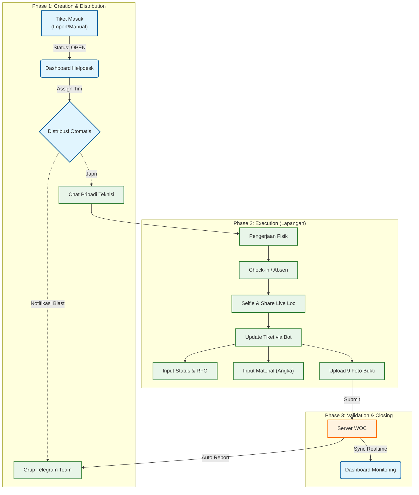

# 📘 WOC (Warga Online Ceria) - Master Documentation
**Project Status:** READY FOR DEVELOPMENT 🚀
**Version:** 3.0 (Consolidated)

---

## 📋 Daftar Isi
1.  [Ringkasan Eksekutif](#1-ringkasan-eksekutif)
2.  [Alur Kerja (Workflow)](#2-alur-kerja-workflow)
3.  [Spesifikasi Fungsional](#3-spesifikasi-fungsional)
    *   3.1 [Manajemen Tiket](#a-modul-manajemen-tiket)
    *   3.2 [Distribusi & Notifikasi](#b-modul-distribusi--notifikasi)
    *   3.3 [Interaksi Bot (Wizard)](#c-modul-interaksi-bot-wizard)
    *   3.4 [Visualisasi Dashboard](#d-visualisasi-dashboard-web)
    *   3.5 [Realtime Tracking](#e-modul-realtime-tracking)
4.  [Arsitektur Teknis (Database)](#4-arsitektur-teknis-database)
5.  [Rencana Eksekusi](#5-rencana-eksekusi)

---

## 1. Ringkasan Eksekutif

**WOC** adalah sistem manajemen pekerjaan lapangan yang mengintegrasikan Dashboard Web untuk monitoring dan Telegram Bot untuk eksekusi teknis ("Headless Technician").

** Tujuan Utama:**
1.  **Efisiensi**: Memangkas birokrasi pelaporan manual >80%.
2.  **Validasi**: Geotagging & Bukti Foto Wajib untuk mencegah fraud.
3.  **Transparansi**: Tracking material dan lokasi teknisi secara real-time.

---

## 2. Alur Kerja (Workflow)



---

## 3. Spesifikasi Fungsional

### A. Modul Manajemen Tiket
**(Sumber: Import Excel & Input Manual)**

**1. Format Import Excel (.xlsx):**
| Header Kolom | Mapping DB | Tipe | Contoh |
| :--- | :--- | :--- | :--- |
| `Incident No` | `incident_no` | Unique | `INC12345` |
| `Service No` | `service_no` | Text | `122333` |
| `Customer Name` | `customer_name` | Text | `Bapak Budi` |
| `Sektor` | `sector` | Text | `BATU AMPAR` |
| `Checklist` | `checklist` | Text | `HVC_GOLD` |

**2. Input Manual:**
Form di dashboard untuk tiket dadakan/urgent yang tidak ada di rekap harian.

### B. Modul Distribusi & Notifikasi
Saat Helpdesk menunjuk Tim di Dashboard, Bot mengirim notifikasi:

```text
🚀 NEW JOB ASSIGNMENT
Tim: SURYA-JAURDAN (SEKTOR BATU AMPAR)
➖➖➖➖➖➖➖➖➖➖➖➖
🆔 Ticket: INC44486767
👤 Service: 162105102907
⚠️ Checklist: HVC_GOLD

📍 LOKASI:
Jl. Mulawarman No 45, RT 02 (Depan Indomaret)

📜 SUMMARY / KELUHAN:
Pelanggan lapor internet mati total. LOS merah.

⏰ SLA Target: 2026-01-20 15:00
➖➖➖➖➖➖➖➖➖➖➖➖
👉 /update_INC44486767 (Klik untuk lapor)
```

### C. Modul Interaksi Bot (Wizard)
Teknisi melakukan update dengan menjawab pertanyaan Bot langkah-demi-langkah.

1.  **Status**: `[✅ CLOSED]` / `[🚧 KENDALA]` / `[⏳ PENDING]`
2.  **Penyebab**: `[Putus Kabel]` / `[Modul]` / dll.
3.  **RFO**: Input teks detail pekerjaan.
4.  **Material**: Input Angka (DC meter, SOC pcs, Prekso pcs).
5.  **Bukti Foto (9 Tahap)**:
    *   1. Rumah (Opsional)
    *   2. ODP (Opsional)
    *   3. Jalur DC (Opsional)
    *   4. **Penyebab (WAJIB)**
    *   5. **Progres (WAJIB)**
    *   6. **After (WAJIB)**
    *   7. **Redaman/OPM (WAJIB)**
    *   8. **SN ONT (WAJIB)**
    *   9. Material Bekas (Opsional)
6.  **Closing**: Laporan terkirim ke Server & Grup Tim.

### D. Visualisasi Dashboard Web
1.  **Productivity Monitor**:
    *   Tabel per Sektor.
    *   Kolom: `Progress`, `Kendala Pelanggan`, `Kendala Teknis`, `Closed`, `Total`.
2.  **Material Report**:
    *   Rekap total pemakaian (Sum JSON) per Sektor.
3.  **Trend Chart**:
    *   Grafik Line volumen tiket harian. 
    *   Series: **HVC** (VVIP, Platinum, Titanium, Gold, Silver), **Reguler**, **Unspec**, **WA**.

### E. Modul Realtime Tracking
1.  **Aktivasi**:
    *   Teknisi ketik `/absen`.
    *   Wajib kirim **Selfie** (Validasi Kehadiran).
    *   Wajib klik **"Share Live Location"** (8 Jam).
2.  **Operasional**:
    *   **12 Jam Kerja**: Di jam ke-8, Bot minta renew location untuk cover sisa waktu (Total 12 Jam).
    *   **Baterai**: Estimasi boros 10-20% (Disarankan Powerbank).
    *   **Libur**: Tidak absen = Tidak dilacak.

---

## 4. Arsitektur Teknis (Database)

**Tech Stack**: Python FastAPI (Backend), PostgreSQL (DB), Next.js 14 (Frontend).

### A. Tabel `teams`
| Kolom | Tipe | Desc |
| :--- | :--- | :--- |
| `id` | SERIAL | PK |
| `team_name` | VARCHAR | Nama Tim |
| `telegram_group_id` | BIGINT | ID untuk Notifikasi Blast |
| `sector` | VARCHAR | Grouping Wilayah |

### B. Tabel `users`
| Kolom | Tipe | Desc |
| :--- | :--- | :--- |
| `id` | SERIAL | PK |
| `full_name` | VARCHAR | Nama Personel |
| `telegram_chat_id` | BIGINT | ID Telegram (Unique) |
| `role` | ENUM | ADMIN, HELPDESK, TECHNICIAN |
| `last_lat` | FLOAT | Posisi Terakhir |
| `last_long` | FLOAT | Posisi Terakhir |
| `last_seen` | TIMESTAMP | Waktu Update Terakhir |

### C. Tabel `woc_tickets`
| Kolom | Tipe | Desc |
| :--- | :--- | :--- |
| `id` | SERIAL | PK |
| `incident_no` | VARCHAR | Unique ID (INC...) |
| `status` | VARCHAR | OPEN, ASSIGNED, CLOSED... |
| `checklist` | VARCHAR | Kategori (HVC, dll) |
| `summary` | TEXT | Keluhan |
| `assigned_team_id` | INT | FK ke Teams |

### D. Tabel `ticket_updates`
| Kolom | Tipe | Desc |
| :--- | :--- | :--- |
| `id` | SERIAL | PK |
| `ticket_id` | INT | FK ke Ticket |
| `technician_id` | INT | FK ke User |
| `description` | TEXT | RFO teknisi |
| `material_usage` | JSONB | `{"dc": 100, "soc": 2}` |
| `file_ids` | JSONB | ID Foto di Telegram Cloud |

---

## 5. Rencana Eksekusi

1.  **Database Migration**: Implementasi skema tabel di atas.
2.  **Backend Bot**: Setup Webhook, State Machine (Wizard), & Location Listener.
3.  **Frontend**: Dashboard Monitoring & Realtime Map (Leaflet).
