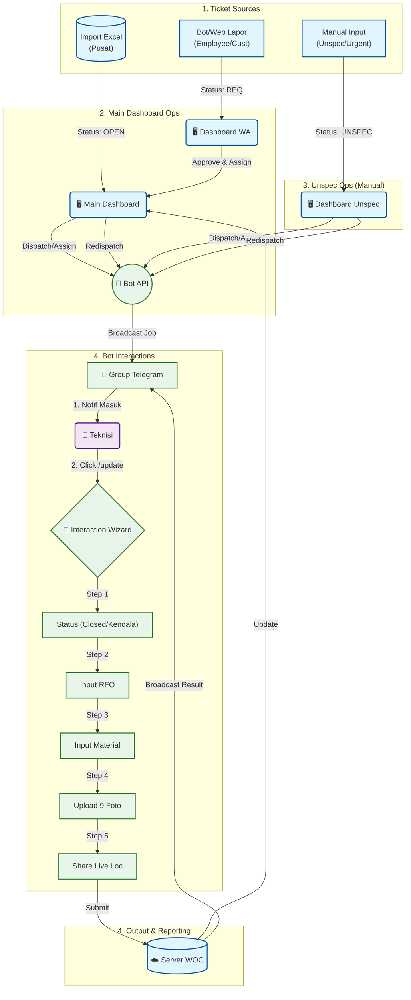

# 📘 WOC (Warga Online Ceria) - Master Documentation
**Project Status:** READY FOR DEVELOPMENT 🚀
**Version:** 3.0 (Consolidated)

---

## 📋 Daftar Isi
1.  [Ringkasan Eksekutif](#1-ringkasan-eksekutif)
2.  [Alur Kerja (Workflow)](#2-alur-kerja-workflow)
3.  [Spesifikasi Fungsional](#3-spesifikasi-fungsional)
    *   3.1 [Manajemen Tiket](#a-modul-manajemen-tiket)
    *   3.2 [Distribusi & Notifikasi](#b-modul-distribusi--notifikasi)
    *   3.3 [Interaksi Bot (Wizard)](#c-modul-interaksi-bot-wizard)
    *   3.4 [Visualisasi Dashboard](#d-visualisasi-dashboard-web)
    *   3.5 [Realtime Tracking](#e-modul-realtime-tracking)
4.  [Arsitektur Teknis (Database)](#4-arsitektur-teknis-database)
5.  [Rencana Eksekusi](#5-rencana-eksekusi)

---

## 1. Ringkasan Eksekutif

**WOC** adalah sistem manajemen pekerjaan lapangan yang mengintegrasikan Dashboard Web untuk monitoring dan Telegram Bot untuk eksekusi teknis ("Headless Technician").

** Tujuan Utama:**
1.  **Efisiensi**: Memangkas birokrasi pelaporan manual >80%.
2.  **Validasi**: Geotagging & Bukti Foto Wajib untuk mencegah fraud.
3.  **Transparansi**: Tracking material dan lokasi teknisi secara real-time.

---

## 2. Alur Kerja (Workflow)



---

## 3. Spesifikasi Fungsional

### A. Modul Manajemen Tiket
**(Sumber: Import Excel & Input Manual)**

**1. Format Import Excel (.xlsx):**
| Header Kolom | Mapping DB | Tipe | Contoh |
| :--- | :--- | :--- | :--- |
| `Incident No` | `incident_no` | Unique | `INC12345` |
| `Service No` | `service_no` | Text | `122333` |
| `Customer Name` | `customer_name` | Text | `Bapak Budi` |
| `Sektor` | `sector` | Text | `BATU AMPAR` |
| `Checklist` | `checklist` | Text | `HVC_GOLD` |

**2. Input Manual / External Sources (Handling Unspec & WA):**

*   **A. Internal Employee (Via Bot)**:
    *   Pegawai lain bisa lapor tiket via Bot.
    *   **Security**: Hanya bisa dilakukan di **Grup Telegram Internal Tertentu** (Whitelist Group ID).
    *   **Command**: `/lapor [No/ID] [Keluhan]` -> Masuk ke Dashboard WA.

*   **B. Customer (Via Web Link)**:
    *   Formulir publik sederhana: `wargaonlineceria.my.id/lapor`.
    *   Input: Nama, No HP, Alamat, Keluhan. -> Masuk ke Dashboard WA.

*   **C. Dashboard WA (Dispatch Queue)**:
    *   Halaman khusus menampung tiket dari Bot/Web Link.
    *   Status Awal: `WA-2026...` (Draft).
    *   **Action Helpdesk**:
        1.  **Approve & Assign**: Langsung dispatch ke teknisi (ID tetap `WA`, nanti diedit jadi `INC`).
        2.  **Reject**: Jika spam/duplikat.

*   **D. Dashboard Unspec**:
    *   Tetap fokus untuk tiket Unspec yang sudah ada di sistem (Import/Manual), flow dispatch standar.

### B. Modul Distribusi & Notifikasi
Saat Helpdesk menunjuk Tim di Dashboard, Bot mengirim notifikasi:

```text
🚀 NEW JOB ASSIGNMENT
Tim: Raffy-Joy (SEKTOR KS TUBUN)
➖➖➖➖➖➖➖➖➖➖➖➖
🆔 Tiket ID: INC12345678
👤 Service ID: 1621012345678
⚠️ Pelanggan ID: HVC_GOLD

📍 LOKASI:
Jl. Mulawarman No 45, RT 02 (Depan Indomaret)

📜 SUMMARY / KELUHAN:
Pelanggan lapor internet mati total. LOS merah.

⏱️ SLA MONITORING:
📅 Reported: 2026-01-20 09:00:00
💣 Deadline: 2026-01-20 12:00:00 (Target 3 Jam)
📉 Sisa TTR: 🔴 LEWAT -21 Jam 30 Menit
👮 Dispatcher: Arya Dharma (12345678)
➖➖➖➖➖➖➖➖➖➖➖➖
👉 /update_INC12345678 (Klik untuk lapor)
```

### C. Modul Interaksi Bot (Wizard)
Skrip detail percakapan Bot saat teknisi melakukan update (Logic State Machine).

**Command**: `/update_INC12345678`

#### Step 1: Status & Penyebab
> **Bot**: "👋 Halo **Raffy**, update status tiket `INC12345678`?"
> **Tombol**: `[✅ CLOSED]` `[🚧 KENDALA]` `[⏳ PENDING]`
>
> *(User klik CLOSED)*
>
> **Bot**: "Oke CLOSED. Apa penyebab utamanya?"
> **Tombol**: `[Putus Kabel]` `[Modul Rusak]` `[Konektor]` `[Power Mati]` `[Lainnya]`

#### Step 2: Detail RFO (Text)
> **Bot**: "Tuliskan detail perbaikan yang dilakukan (Singkat & Jelas):"
> **User**: "Sambung kabel DC 150m dan ganti SOC"

#### Step 3: Input Material (Validasi Angka)
> **Bot**: "🛠 **LAPORAN MATERIAL** (Masukkan angka 0 jika tidak pakai)"
>
> **Bot**: "1. Berapa meter Kabel Dropcore?"
> **User**: "150"
>
> **Bot**: "2. Berapa pcs Konektor/SOC?"
> **User**: "2"
>
> **Bot**: "3. Berapa pcs Prekso?"
> **User**: "0"

#### Step 4: Upload Foto Bukti (9 Tahap)
Bot meminta 9 jenis foto satu per satu.
1.  **📸 FOTO RUMAH** (Opsi: `[⏭ SKIP]`)
2.  **📸 FOTO ODP** (Opsi: `[⏭ SKIP]`)
3.  **📸 FOTO JALUR DC** (Opsi: `[⏭ SKIP]`)
4.  **📸 FOTO PENYEBAB** (WAJIB)
5.  **📸 FOTO PROGRES** (WAJIB)
6.  **📸 FOTO SETELAH PROGRES** (WAJIB)
7.  **📸 FOTO REDAMAN** (WAJIB)
8.  **📸 FOTO SN ONT** (WAJIB)
9.  **📸 FOTO MATERIAL** (Opsi: `[⏭ SKIP]`)

#### Step 5: Lokasi & Closing
> **Bot**: "📍 Terakhir, **SHARE LIVE LOCATION** posisi Anda sekarang."
> **User**: *(Mengirim Attachment Location)*
>
> **Bot**: "✅ **TIKET CLOSED!** Data tersimpan. Laporan telah diteruskan ke Grup."

#### Output: Laporan Selesai (Broadcast ke Grup)
Pesan otomatis yang dikirim Bot ke Grup Tim setelah wizard selesai.

> **ℹ️ Catatan Logic:**
> Nama Teknisi (`Raffy` / `Joy`) diambil dari database tabel `users` kolom `full_name` berdasarkan `chat_id` pengirim. Bukan dari Display Name Telegram (agar nama tetap formal & standar).

**A. Sukses (CLOSED) ✅**
```text
✅ **JOB COMPLETED (CLOSED)**
Tim: **Raffy-Joy**
➖➖➖➖➖➖➖➖➖➖➖➖
🆔 Ticket: `INC12345678`
👤 Service: `1621012345678`
🛠️ Teknisi: **Raffy**

📊 **HASIL PEKERJAAN:**
• Penyebab: Putus Kabel
• RFO: `Sambung kabel DC 150m dan ganti SOC`

📦 **MATERIAL:**
• Dropcore: 150 m
• SOC: 2 pcs

📸 **EVIDENCE (9 Foto):**
(Media Album terkirim otomatis di bawah pesan ini)

📍 **LOKASI CLOSING:**
(Map Location Attachment)

⏱️ **DURASI:** 1 Jam 30 Menit
➖➖➖➖➖➖➖➖➖➖➖➖
```

**B. Pending (KENDALA) 🚧**
```text
🚧 **JOB PENDING (KENDALA)**
Tim: **Raffy-Joy**
➖➖➖➖➖➖➖➖➖➖➖➖
🆔 Ticket: `INC12345678`
👤 Service: `1621012345678`
🛠️ Teknisi: **Raffy**

⚠️ **DETAIL KENDALA:**
• Kategori: Pelanggan (Rumah Tutup / Tidak Respon)
• Ket: `Sudah gedor pagar 3x, telpon tidak diangkat`

📸 **BUKTI KUNJUNGAN (1-2 Foto):**
(Foto Rumah / Pagar / Call Log)

📍 **LOKASI TERAKHIR:**
(Map Location Attachment)
➖➖➖➖➖➖➖➖➖➖➖➖
```

### D. Visualisasi Dashboard Web
1.  **Productivity Monitor**:
    *   Tabel per Sektor.
    *   Kolom: `Progress`, `Kendala Pelanggan`, `Kendala Teknis`, `Closed`, `Total`.
2.  **Material Report**:
    *   Rekap total pemakaian (Sum JSON) per Sektor.
3.  **Trend Chart**:
    *   Grafik Line volumen tiket harian. 
    *   Series: **HVC** (VVIP, Diamond, Platinum, Gold, Silver), **Reguler**, **Unspec**, **WA**, **SQM**.

### E. Modul Realtime Tracking
1.  **Aktivasi**:
    *   Teknisi ketik `/absen`.
    *   Wajib kirim **Selfie** (Validasi Kehadiran).
    *   Wajib klik **"Share Live Location"** (8 Jam).
2.  **Operasional**:
    *   **12 Jam Kerja**: Di jam ke-8, Bot minta renew location untuk cover sisa waktu (Total 12 Jam).
    *   **Baterai**: Estimasi boros 10-20% (Disarankan Powerbank).
    *   **Libur**: Tidak absen = Tidak dilacak.

### F. Modul Redispatch (Operan Tiket / Lanjutan)
Fitur untuk mengalihkan tugas ke Tim Lain atau menjadwalkan ulang, **APAPUN STATUSNYA** (Open, In Progress, Kendala). 
*Kasus: Teknisi sakit mendadak, mobil mogok, atau pendingan kemarin.*

1.  **Dashboard Flow**:
    *   Helpdesk pilih tiket (Status bebas, kecuali Closed).
    *   Klik tombol **Redispatch**.
    *   **Pilih Tim Baru** (Bisa tim sama atau oper ke tim lain).
    *   **Pilih Tanggal Pengerjaan** (Hari ini / Besok).
2.  **System Action**:
    *   Update data: `redispatch_by` (User Helpdesk) & `redispatch_at` (Waktu klik).
    *   Mengirim Notifikasi Baru ke Grup Tim (Format berbeda: **♻️ REDISPATCH**).
3.  **Bot Notification (Redispatch)**:
    ```text
    **TIKET REDISPATCH**
    Tim: **Raffy-Joy**
    ➖➖➖➖➖➖➖➖➖➖➖➖
    Ticket: `INC12345678`
    Service: `1621012345678`
    ⚠️ Kendala Sebelumnya: **Rumah Tutup**
    
    📍 **Alamat:**
    Jl. Mulawarman No 45...
    
    **Redispatch By:** Arya Dharma (21:02 WITA)
    ➖➖➖➖➖➖➖➖➖➖➖➖
    👉 /update_INC12345678
    ```

---

## 4. Arsitektur Teknis (Database)

**Tech Stack**: Python FastAPI (Backend), PostgreSQL (DB), Next.js 14 (Frontend).

### A. Tabel `teams`
| Kolom | Tipe | Desc |
| :--- | :--- | :--- |
| `id` | SERIAL | PK |
| `team_name` | VARCHAR | Nama Tim |
| `telegram_group_id` | BIGINT | ID untuk Notifikasi Blast |
| `sector` | VARCHAR | Grouping Wilayah |

### B. Tabel `users`
| Kolom | Tipe | Desc |
| :--- | :--- | :--- |
| `id` | SERIAL | PK |
| `full_name` | VARCHAR | Nama Personel |
| `telegram_chat_id` | BIGINT | ID Telegram (Unique) |
| `role` | ENUM | ADMIN, HELPDESK, TECHNICIAN |
| `last_lat` | FLOAT | Posisi Terakhir |
| `last_long` | FLOAT | Posisi Terakhir |
| `last_seen` | TIMESTAMP | Waktu Update Terakhir |

### C. Tabel `woc_tickets`
| Kolom | Tipe | Desc |
| :--- | :--- | :--- |
| `id` | SERIAL | PK |
| `incident_no` | VARCHAR | Unique ID (INC...) |
| `status` | VARCHAR | OPEN, ASSIGNED, CLOSED... |
| `checklist` | VARCHAR | Kategori (HVC, dll) |
| `summary` | TEXT | Keluhan |
| `assigned_team_id` | INT | FK ke Teams |

### D. Tabel `ticket_updates`
| Kolom | Tipe | Desc |
| :--- | :--- | :--- |
| `id` | SERIAL | PK |
| `ticket_id` | INT | FK ke Ticket |
| `technician_id` | INT | FK ke User |
| `description` | TEXT | RFO teknisi |
| `material_usage` | JSONB | `{"dc": 100, "soc": 2}` |
| `file_ids` | JSONB | ID Foto di Telegram Cloud |

---

## 5. Rencana Eksekusi

1.  **Database Migration**: Implementasi skema tabel di atas.
2.  **Backend Bot**: Setup Webhook, State Machine (Wizard), & Location Listener.
3.  **Frontend**: Dashboard Monitoring & Realtime Map (Leaflet).
