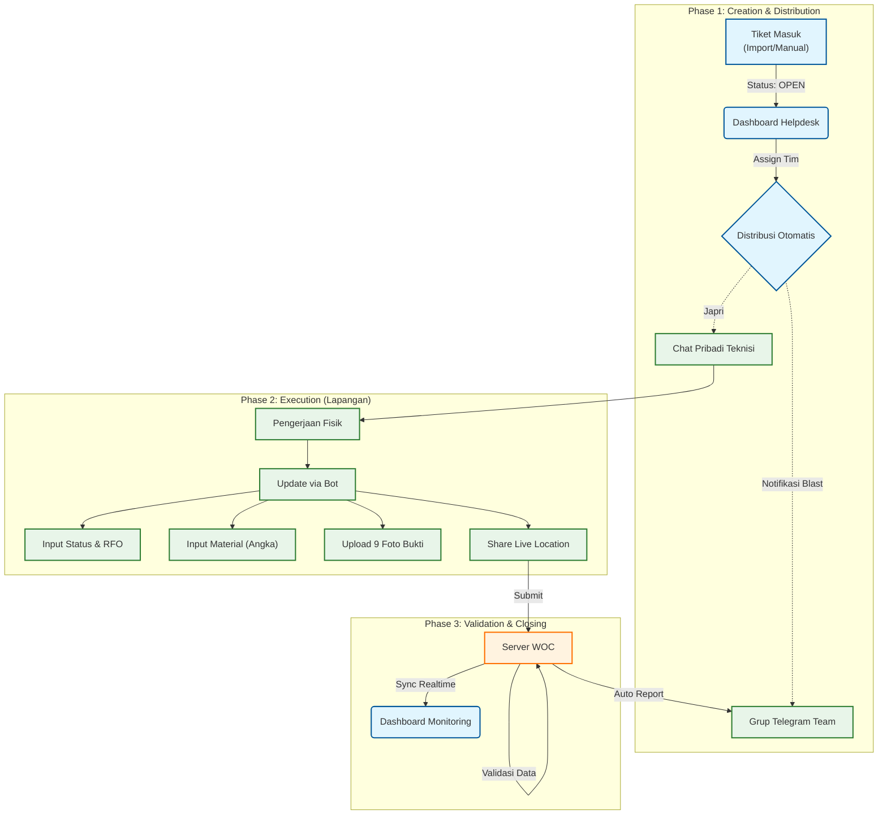

# 🚀 Proposal Sistem Manajemen Pekerjaan Terpadu
**Project Codename: WOC (Warga Online Ceria) - Technical Specification Document**

  

---

## 📋 Daftar Isi
1. [Ringkasan Eksekutif](#-ringkasan-eksekutif)
2. [Analisis Masalah & Solusi](#-analisis-masalah--solusi)
3. [Arsitektur Sistem Terintegrasi](#-arsitektur-sistem-terintegrasi)
4. [Alur Kerja (Workflow Diagram)](#-alur-kerja-workflow-diagram)
5. [Spesifikasi Fitur Mendalam](#-spesifikasi-fitur-mendalam)
6. [Analitik & Dashboard Manajemen](#-analitik--dashboard-manajemen)
7. [Dampak Bisnis (Business Impact)](#-dampak-bisnis-business-impact)

---

## 📅 Ringkasan Eksekutif

**WOC (Warga Online Ceria)** adalah ekosistem manajemen pekerjaan (Work Order Management System) yang dirancang khusus untuk operasional lapangan telekomunikasi. Sistem ini meniadakan kesenjangan komunikasi antara **Helpdesk (Dashboard)** dan **Teknisi (Lapangan)** dengan menggunakan **Telegram Bot** sebagai antarmuka utama.

Tujuan utama sistem ini adalah:
1.  **Akurasi Data**: Memastikan setiap update status disertai bukti valid (Foto & Lokasi).
2.  **Efisiensi Waktu**: Memangkas waktu pelaporan administrasi teknisi hingga 80%.
3.  **Transparansi Material**: Melacak penggunaan material per tiket secara real-time.

---

## 🔍 Analisis Masalah & Solusi

| Pain Point Saat Ini ❌ | Solusi WOC ✅ | Benefit Bisnis |
| :--- | :--- | :--- |
| **Laporan Manual Teks** Teknisi mengetik format panjang berulang-ulang, rawan typo & data tidak standar. | **Interactive Wizard** Bot menuntun teknisi langkah demi langkah. Data standar & terstruktur. | **Data Integrity** Rekap laporan menjadi otomatis & akurat. |
| **Tanpa Validasi Lokasi** Sulit memastikan teknisi benar-benar di rumah pelanggan saat closing. | **Geotagging Lock** Sistem mewajibkan *Share Live Location* sebelum tiket bisa di-close. | **Fraud Prevention** Mencegah laporan fiktif (tembak koordinat). |
| **Buta Data Material** Pemakaian kabel/konektor hanya tercatat di chat, sulit direkap. | **Material Structured Input** Input material berupa angka (Integer) yang langsung masuk database. | **Cost Control** Mencegah kebocoran aset material perusahaan. |

---

## 🏗 Arsitektur Sistem Terintegrasi

Kami menerapkan konsep **"Headless Technician" Architecture**:

1.  **Frontend (Command Center)**: Next.js 14 Dashboard
    *   Digunakan oleh Helpdesk/Leader & Manajemen.
    *   Fitur: Assignment, Monitoring Peta, Approval, Reporting.
2.  **Interface Lapangan**: Telegram Bot API
    *   Digunakan oleh Teknisi (Tanpa perlu install aplikasi berat).
    *   Fitur: Notifikasi Job, Upload Foto, Input Laporan.
3.  **Backend Core**: Python FastAPI + PostgreSQL
    *   Logic Engine: State Machine untuk mengatur alur percakapan bot.
    *   Storage: Zero-Local Storage (Menggunakan Telegram Cloud untuk foto).

---

## 🔄 Alur Kerja (Workflow Diagram)

Proses _End-to-End_ dari tiket masuk hingga penyelesaian:

---

## 🛠 Spesifikasi Fitur Mendalam

### 1. Sistem Notifikasi Cerdas (Smart Notification)
Bot tidak hanya mengirim teks biasa, tapi menggunakan format **"Card Style"** yang didesain untuk keterbacaan di layar HP.
*   **Visual Hierarchy**: Emoji sebagai penanda urgensi.
*   **Click-to-Copy**: Nomor Tiket & Layanan diformat `Monospace` agar mudah disalin sekali tap.
*   **Direct Action Link**: Tombol `/update_INC...` tersedia di bawah setiap pesan notifikasi.

### 2. Validasi Bukti Bertingkat (Multi-Layer Evidence)
Sistem mewajibkan 9 jenis bukti foto untuk memastikan kualitas pekerjaan (Quality Assurance):
1.  **Rumah (Depan)**: Memastikan alamat benar.
2.  **ODP (Sebelum/Sesudah)**: Memastikan kerapihan terminasi.
3.  **Redaman (OPM)**: Bukti kualitas sinyal (Foto layar alat ukur).
4.  **SN ONT**: Validasi perangkat terpasang.
5.  *(Dan 5 kategori lainnya...)*
*> Fitur **SKIP** tersedia untuk foto yang bersifat opsional/situasional.*

### 3. Keamanan & Kontrol Akses
*   **Whitelist Only**: Bot hanya merespon akun Telegram yang ID-nya sudah terdaftar di database Admin.
*   **Team Isolation**: Teknisi hanya bisa meng-update tiket yang di-assign ke Tim mereka.

---

## 📊 Analitik & Dashboard Manajemen

Dashboard WOC menyediakan **"Helicopter View"** real-time bagi manajemen:

### A. Productivity Matrix (Kinerja Tim)
> *"Siapa tim paling produktif hari ini? Siapa yang sering pending tiket?"*
*   Menampilkan tabel perbandingan antar Sektor & Tim.
*   Metrik: Jumlah Tiket Selesai vs Tiket Kendala vs Tiket Open.

### B. Material Reconciliation (Kontrol Aset)
> *"Berapa meter kabel dropcore yang keluar di Sektor Batakan hari ini?"*
*   Menghitung total material berdasarkan input angka dari teknisi.
*   Mencegah selisih stok gudang dengan pemakaian lapangan.

### C. Ganguan Trend Analysis
*   Grafik tren harian untuk memprediksi lonjakan gangguan (misal: akibat cuaca).

---

## 📈 Dampak Bisnis (Business Impact)

Implementasi WOC diproyeksikan memberikan dampak positif terukur:

1.  **Kecepatan Closing Tiket**: Meningkat **~40%** karena pemangkasan birokrasi pelaporan.
2.  **Akurasi Data Aset**: Validasi input material mencegah kebocoran aset hingga **~15%**.
3.  **Kualitas Jaringan**: Kewajiban foto standardisasi (seperti Redaman) memaksa teknisi bekerja sesuai SOP, mengurangi angka Repeat Gangguan * (Repair Quality)*.

---

*WOC: Solusi modern, hemat biaya, dan efisien untuk operasional lapangan masa depan.*
