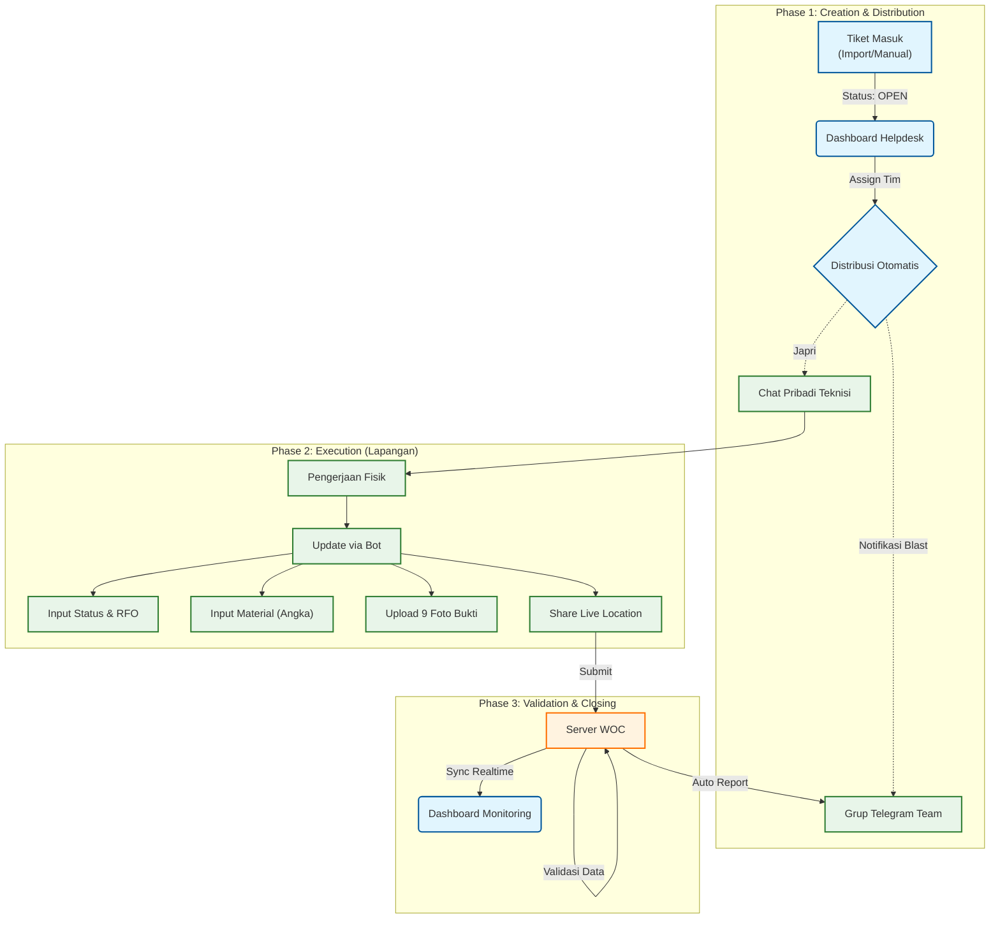

# 📘 Dokumen Spesifikasi Sistem: WOC (Warga Online Ceria)
**Level Detail: Functional Specification Document (FSD)**
**Project Status:** Ready for Development

 

---

---

## 🗺️ Alur Kerja Sistem (Workflow Diagram)



---

## 1. Modul Manajemen Tiket (Ticket Creation)

Modul ini menangani bagaimana data pekerjaan masuk ke sistem **sebelum** dikerjakan tim.

### A. Metode 1: Bulk Import (Via Excel)
Admin/Helpdesk mengupload file `.xlsx` rekap gangguan harian.

**📝 Spesifikasi Format Excel:**
File wajib memiliki header kolom berikut (Case Insensitive):

| Kolom Excel | Mapping Database | Tipe Data | Contoh Data |
| :--- | :--- | :--- | :--- |
| `Incident No` | `incident_no` | Text (Unique) | `INC12345678` |
| `Service No` | `service_no` | Text | `122333444555` |
| `Customer Name` | `customer_name` | Text | `Bapak Budi Santoso` |
| `Address` | `customer_address`| Text | `Jl. Sudirman No 45, Balikpapan` |
| `Sektor` | `sector` | Text | `BATU AMPAR` |
| `Workzone` | `workzone` | Text | `Witel Balikpapan` |
| `Summary` | `summary` | Text | `LOS Merah, kabel putus digigit tikus` |
| `SLA` | `sla_date` | DateTime | `2026-01-20 15:00:00` |
| `Checklist` | `checklist` | Text | `HVC_GOLD` |

**⚙️ Proses Sistem:**
1.  Sistem membaca baris per baris.
2.  **Validasi Duplikasi**: Jika `Incident No` sudah ada di DB dengan status `OPEN`, skip baris tersebut.
3.  **Default Status**: Semua data yang berhasil diimport otomatis berstatus `OPEN` dan `Mapped Team: NULL`.

### B. Metode 2: Input Manual (Dadakan)
Formulir di Web Dashboard untuk input tiket urgent yang tidak masuk rekap Excel.

**Form UI:**
*   [Input] No Insiden *
*   [Input] No Layanan *
*   [Input] Nama Pelanggan *
*   [Textarea] Alamat Lengkap *
*   [Select] Sektor (Dropdown list dari tabel `teams`)
*   [Textarea] Keluhan / Summary *
*   [Tombol] **SIMPAN TIKET**

---

## 2. Modul Distribusi & Notifikasi (Assign Ticket)

Proses penunjukan Tim oleh Helpdesk yang memicu notifikasi Bot.

### A. Fitur Assign (Web Dashboard)
Tampilan Tabel Tiket `OPEN`:
*   **Kolom**: ID, Customer, Alamat, Summary.
*   **Action**: Dropdown "Pilih Tim" di setiap baris.
*   **Data Source Dropdown**: Mengambil dari tabel `teams` (Hanya tampilkan tim di Sektor yang sesuai).

### B. Format Notifikasi Bot (Telegram)
Saat tombol assign diklik, Bot mengirim pesan ke **Grup Telegram Tim** dan **PM Teknisi**.

**Mockup Teks Notifikasi (Final):**
```text
🚀 NEW JOB ASSIGNMENT
Tim: SURYA-JAURDAN (SEKTOR BATU AMPAR)
➖➖➖➖➖➖➖➖➖➖➖➖
🆔 Ticket: INC44486767
👤 Service: 162105102907
⚠️ Checklist: HVC_GOLD

📍 LOKASI:
Jl. Mulawarman No 45, RT 02 (Depan Indomaret)

📜 SUMMARY / KELUHAN:
Pelanggan lapor internet mati total sejak hujan semalam. Indikator LOS merah berkedip.

⏰ SLA Target: 2026-01-20 15:00
➖➖➖➖➖➖➖➖➖➖➖➖
👉 /update_INC44486767 (Klik untuk lapor)
```

---

## 3. Modul Interaksi Bot (Technician Wizard)

Skrip detail percakapan Bot saat teknisi melakukan update (Logic State Machine).

**Command**: `/update_INC44486767`

#### Step 1: Status & Penyebab
> **Bot**: "👋 Halo **Agus**, update status tiket `INC44486767`?"
>
> **Tombol**: `[✅ CLOSED]` `[🚧 KENDALA]` `[⏳ PENDING]`
>
> *(User klik CLOSED)*
>
> **Bot**: "Oke CLOSED. Apa penyebab utamanya?"
>
> **Tombol**: `[Putus Kabel]` `[Modul Rusak]` `[Konektor]` `[Power Mati]` `[Lainnya]`

#### Step 2: Detail RFO (Text)
> **Bot**: "Tuliskan detail perbaikan yang dilakukan (Singkat & Jelas):"
>
> **User**: "Sambung kabel DC 150m dan ganti SOC"

#### Step 3: Input Material (Validasi Angka)
> **Bot**: "🛠 **LAPORAN MATERIAL**
> Masukkan angka **0** jika tidak pakai.
>
> **1. Berapa meter Kabel Dropcore?**"
>
> **User**: "150"
>
> **Bot**: "**2. Berapa pcs Konektor/SOC?**"
>
> **User**: "2"
>
> **Bot**: "**3. Berapa pcs Prekso?**"
>
> **User**: "0"

#### Step 4: Upload Foto Bukti (9 Tahap)
Bot meminta 9 jenis foto satu per satu untuk validasi lengkap.

1.  **📸 FOTO RUMAH (Tampak Depan)**
    *   *Desc*: Untuk memastikan teknisi di alamat yang benar.
    *   *Opsi*: `[⏭ SKIP]` (Jika rumah tidak ketemu/kendala akses).
2.  **📸 FOTO ODP (Label & Port)**
    *   *Desc*: Kondisi ODP sebelum/sesudah pengerjaan.
    *   *Opsi*: `[⏭ SKIP]`
3.  **📸 FOTO JALUR DC (Dropcore)**
    *   *Desc*: Rute bentangan kabel dari tiang ke rumah.
    *   *Opsi*: `[⏭ SKIP]`
4.  **📸 FOTO PENYEBAB (Kerusakan)**
    *   *Desc*: Bukti fisik kerusakan (ex: Kabel putus, Modul mati).
    *   *Status*: **WAJIB**
5.  **📸 FOTO PROGRES (Pengerjaan)**
    *   *Desc*: Foto teknisi saat sedang menyambung/memperbaiki.
    *   *Status*: **WAJIB**
6.  **📸 FOTO SETELAH PROGRES (Perapihan)**
    *   *Desc*: Hasil akhir yang sudah rapi (ex: Roset terpasang).
    *   *Status*: **WAJIB**
7.  **📸 FOTO REDAMAN (Layar OPM)**
    *   *Desc*: Bukti nilai sinyal (dBm) di sisi pelanggan.
    *   *Status*: **WAJIB**
8.  **📸 FOTO SN ONT (Stiker Modem)**
    *   *Desc*: Validasi perangkat yang terpasang di lokasi.
    *   *Status*: **WAJIB**
9.  **📸 FOTO MATERIAL (Sisa/Bekas)**
    *   *Desc*: Foto potongan kabel atau konektor bekas ganti.
    *   *Opsi*: `[⏭ SKIP]`

#### Step 5: Lokasi & Closing
> **Bot**: "📍 Terakhir, **SHARE LIVE LOCATION** posisi Anda sekarang."
>
> **User**: *(Mengirim Attachment Location)*
>
> **Bot**: "✅ **TIKET CLOSED!** Data tersimpan. Laporan telah diteruskan ke Grup."

---

## 4. Visualisasi Dashboard Web

Desain detail halaman web untuk manajemen.

### Halaman 1: dashboard/productivity
**Layout**: 3 Bagian Utama.

1.  **KPI Cards (Atas)**
    *   [Total Tiket Hari Ini]
    *   [Total CLOSED]
    *   [Total KENDALA]
    *   [Persentase Closing (%)]

2.  **Tabel Monitor Sektor (Tengah)**
    *   Header: `Nama Sektor` | `Jml Tim` | `Ticket Open` | `Progress` | `Kendala Plg` | `Kendala Tek` | `Closed` | `Total`.
    *   *Fitur*: Row bisa di-expand untuk melihat detail per Tim di sektor tersebut.

3.  **Grafik Tren (Bawah)**
    *   Jenis: Line Chart.
    *   Data: Volume Tiket per Jam (08:00 - 17:00).
    *   Legend: HVC, Reguler, Unspec, WA.

### Halaman 2: dashboard/material
**Layout**: Tabel Rekapitulasi.

*   **Filter**: Tanggal Mulai - Tanggal Akhir.
*   **Tabel Data**:
    *   Header: `Sektor` | `Dropcore (m)` | `SOC (pcs)` | `Prekso (pcs)` | `Patchcord (pcs)` | `Adapter (pcs)`.
    *   *Logic*: Sum kolom JSON `material_usage` dari database.

---

## 5. Modul Realtime Tracking (Live Map)

Fitur pemantauan posisi teknisi di lapangan menggunakan fitur **Telegram Live Location**.

### A. Alur Aktivasi (Sisi Teknisi)
1.  **Check-In**: Teknisi ketik `/absen` di pagi hari.
2.  **Request**: Bot membalas "Silakan **Share Live Location** untuk 8 Jam".
3.  **Action**: Teknisi klik *Attach -> Location -> Share My Live Location for 8 Hours*.
4.  **Sync**: Telegram akan mengirim update koordinat ke server setiap teknisi bergerak, tanpa perlu interaksi manual lagi.

### B. Tampilan Peta (Sisi Dashboard)
Seperti referensi gambar:
*   **Map View**: Menampilkan peta wilayah kerja.
*   **Markers**: Icon helm teknisi di posisi terkini.
*   **Popup**: Klik marker untuk lihat "Nama Teknisi", "Tim", "Update Terakhir".
*   **Status**: Marker jadi abu-abu jika `last_seen` > 1 jam (Offline/GPS Mati).

> **⚠️ Catatan Teknis (Telegram Limitation):**
> *   Bot **TIDAK BISA** melacak lokasi secara diam-diam (background spy).
> *   Teknisi **WAJIB** memulai dengan klik "Share Live Location".
> *   **Background Mode**: Setelah diaktifkan, teknisi bisa menutup aplikasi Telegram atau mematikan layar, dan lokasi **TETAP TERKIRIM** selama durasi yang dipilih (8 Jam).
> *   **🔋 Konsumsi Baterai**: Fitur ini menggunakan GPS intensif. Estimasi pengurasan baterai ekstra **~10-20%** per shift. **Sangat disarankan** teknisi menyediakan Powerbank atau charger di kendaraan.

---

## 6. Ringkasan Teknis (Database)

Struktur tabel inti yang mendukung seluruh fitur di atas.

```sql
-- Tabel Tiket Utama
CREATE TABLE woc_tickets (
    id SERIAL PRIMARY KEY,
    incident_no VARCHAR(50) UNIQUE, -- Kunci utama
    service_no VARCHAR(50),
    customer_name VARCHAR(100),
    customer_address TEXT,
    summary TEXT,
    status VARCHAR(20) DEFAULT 'OPEN', -- OPEN, IN_PROGRESS, CLOSED
    checklist VARCHAR(50), -- HVC_GOLD, dll
    assigned_team_id INT NULL -- Diisi saat Assign
);

-- Tabel Log Update (Menyimpan hasil Wizard Bot)
CREATE TABLE ticket_updates (
    id SERIAL PRIMARY KEY,
    ticket_id INT REFERENCES woc_tickets(id),
    technician_id INT, -- Siapa yang lapor
    status_update VARCHAR(20),
    description TEXT, -- RFO
    material_usage JSONB, -- {"dc": 150, "soc": 2}
    file_ids JSONB, -- {"house": "AgAC...", "odp": "..."}
    coordinates VARCHAR(100), -- "-1.245, 116.88"
    created_at TIMESTAMP DEFAULT NOW()
);
```

*Dokumen spesifikasi ini adalah acuan final untuk pengembangan sistem.*
